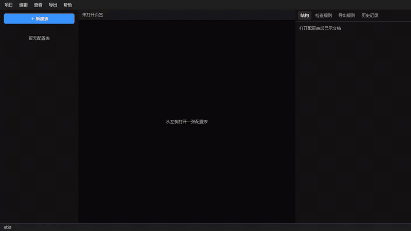

# AI时代的全新游戏配表方式

> 本项目的目标是完全抛弃Excel的配表方式，让配置表能能更好的融合进AI工作流

核心特性：

- 所有的内容都是纯文本，对版本管理和AI都非常友好
- 每一张配置表都有自己独特的编辑方式，表的结构，检查/导表规则，甚至连修改历史记录都可以在编辑器里一览无余
- 数值表同时能兼顾AI修改和人工微调，并且可以用图表等更直观表现形式去做校对
- 支持配置更加复杂的数据结构
- 多人同时修改同一张表时不易产生冲突，就算是冲突了也可以用AI轻松解决
- 在配表阶段就已经把错误扼杀在摇篮



## 一张配置表里有什么

```text
{root}/
  item/
    item_struct.yaml
    item_data.yaml
    item_editor.ts
    item_checker.ts
    item_export.ts
    item_docs.md
```

`struct.yaml` 是描述字段和 sheet

`data.yaml` 是数值表

`editor.ts` 是画这张表的界面代码，要表格、卡片还是图都可以，没有的话工作台会给一个简易表格（仍兼容 `editor.js`）

`checker.ts` 是规则检查脚本，错了会标到具体字段，比如 `sheets.items.rows.0.id`

`export.ts` 是导表规则脚本，分别产出客户端与服务端文件，写入配表根上一级 `build/client/` 与 `build/server/`

`docs.md` 是结构、检查规则、导出规则的文档，AI改完表就会顺手改这个文档，方便之后查看。

```yaml
# item_struct.yaml
id: item
name: 道具表
default_sheet: items
sheets:
  - id: items
    name: 道具
    fields:
      - key: id
        type: string
        required: true
      - key: kind
        type: enum
        widget: select
        enum: kinds
  - id: kinds
    name: 分类
    kind: enum
    fields:
      - key: id
        type: string
      - key: name
        type: string

# item_data.yaml
sheets:
  items:
    rows:
      - id: sword
        name: 铁剑
        kind: weapon
  kinds:
    rows:
      - id: weapon
        name: 武器
```

约定见 [docs/spec.md](docs/spec.md)。给 Agent 用的提示见 [AGENTS.md](AGENTS.md)。

## 开发

需要 Go 1.23+ 与 Node.js。默认打开本仓库 [demo/tables](demo/tables)（含 `sheet_demo`、`enum_demo` 等示例表；资源在 [demo/res](demo/res)；共享控件基类在 [demo/src](demo/src)，表脚本用 `bit-tables.editor` 等别名引用）。

```powershell
npm install
npm run dev
```

## 下载

[v0.1.0](https://github.com/xcoding1024/bit-tables/releases/tag/v0.1.0) 提供各平台桌面 zip：

- Windows x64：`bit-tables-0.1.0-win-x64.zip`
- Linux x64：`bit-tables-0.1.0-linux-x64.zip`
- macOS Intel：`bit-tables-0.1.0-mac-x64.zip`
- macOS Apple Silicon：`bit-tables-0.1.0-mac-arm64.zip`

解压后运行可执行文件。

## 桌面打包

Windows zip（本机）：

```powershell
npm run pack:win
```

产物在 `dist/desktop/`。Linux / macOS：

```powershell
npm run pack:linux
npm run pack:mac
```

macOS 安装包请在 Mac 上打。启动时自动打开上次的配表目录；若无记录则进入引导页（打开已有目录或创建示例项目）。「项目 → 最近打开」可切换历史目录。

## 命令行

仍可用 HTTP 服务调试 API：

```bash
go run ./cmd/bit-tables serve ./demo/tables
```

空目录写入示例（推荐 `.../tables` 作为配表根，会在上一级写入完整示例项目）：

```bash
go run ./cmd/bit-tables serve D:\game\demo\tables --sample
```

桌面端「创建示例项目」会向所选目录写入示例（`tables` / `src` / `res` / 导表脚本），并以其中的 `tables` 作为配表根。

嵌入宿主：`http://127.0.0.1:18780/?embed=1&table=item`。

### 命令行导表（demo）

[demo](demo) 提供跨平台导表脚本（需 Node.js），跑各表 `*_export.ts`，产物写入 `demo/build/client` 与 `demo/build/server`。

```bash
# Linux / macOS
./demo/export.sh
./demo/export.sh sheet_demo

# Windows
demo\export.cmd
demo\export.cmd sheet_demo

# 或任意平台直接用 Node
cd demo && npm install && node export.mjs --all
```

指定表 id 时会连带导出引用它的下游表（与工作台「导出当前表」一致）。

仅交叉编译 CLI 二进制：

```powershell
powershell -File scripts/build-all.ps1
```

## 测试

```bash
go test ./...
```
